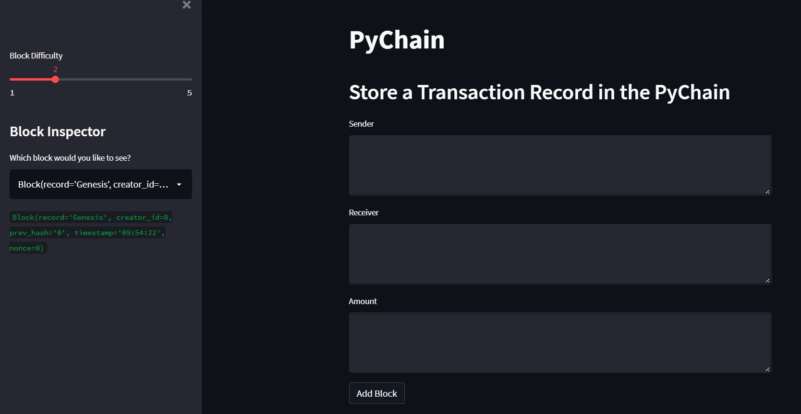
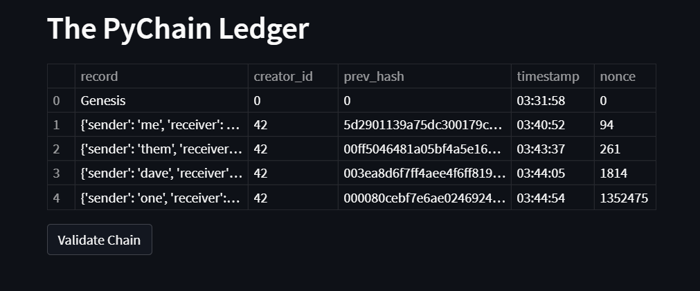
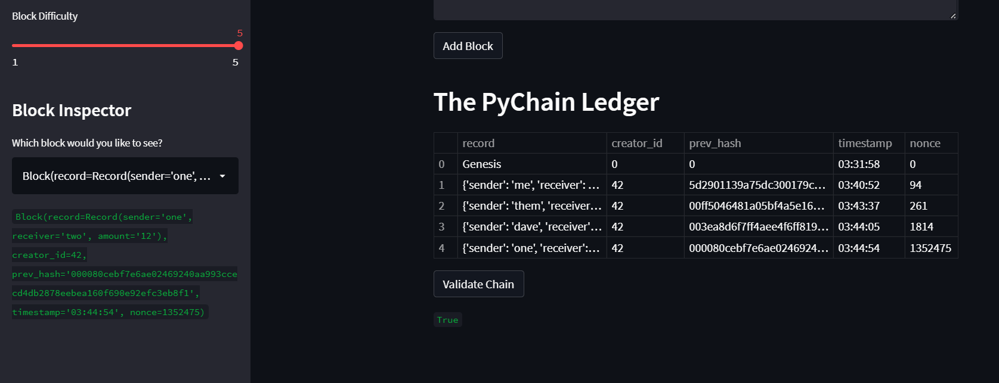

# Python Hashblock Chaining

This is a demo app written in python which handles the creation and validation of hashed-block transaction records in a mock blockchain environment. A front end has been created with streamlit to add dynamically add entries to the chain.

## Instructions & Execution

This program is run via streamlit (streamlit run pychain.py) which will create a local hosted webpage which will allow you to set parameters and add blocks to the chain as seen below:

There are no restrictions to the sender, receiver, and amount fields. The difficulty slider slides between 1-5, and you can also find the list of blocks in the chain currently, and select them in the dropdown box to view their contents.

There is a ledger that shows you the current chain of blocks and some of their contents:

And there is also a validation checker via a button right below the ledger, which outputs a Boolean

## Program Structure

Classes are used to store records(sender, receiver, amount, Blocks, and the chain itself. The rest of the file is used to create the frontend of the pogram using streamlit which will facilitate filling in record fields and creating new blocks on the chain. When the program is run it will initialise with a chain class with an empty list and a genesis hash

### Record

The records class is a holder for transaction records to be stored inside blocks. It stores the sender's name, receiver's name, and the amount being transacted similar to what a bitcoin transaction record would look like

### Block

Blocks will represent each block in our chain. The block stores a transaction record, a creator_id, the previous hash initialised as 0, a timestamp initialised at time of creation, and a nonce initialised at 0. The nonce in this program represents the number of hashing attempts that were made to produce an accepted hash. The Block has a method called hash_block() that hashes the contents of the Block using a sha256 hasher from hashlib

### Pychain

Pychain represents the blockchain itself as such it stores a list of Blocks. It also stores a difficulty integer that represents the number of zeros a hash needs to produce to be accepted. Pychain has three methods, two of which are add_block(), which adds a Block to the chain, and is_valid(), which checks if each block's previous hash properly references the previous Block. The add_block() method will also call the proof_of_work() method that will force the Block to rehash until it has a number of starting zeros equal to to the difficulty